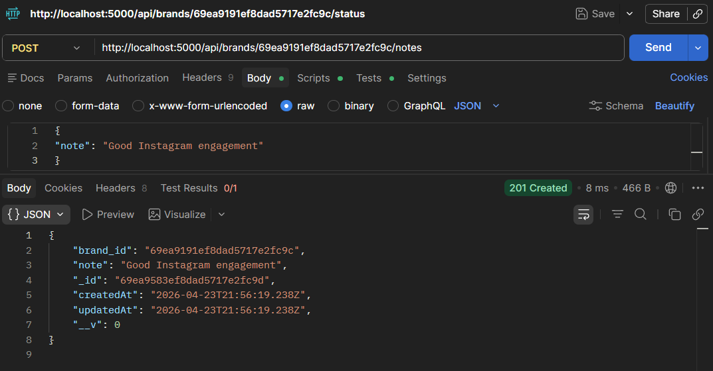
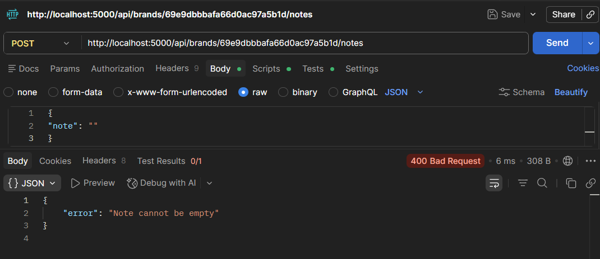

# 📄 D2C Brand Onboarding & Tracking System

## 🏢 Project Overview
This project is an internal admin tool designed to manage Direct-to-Consumer (D2C) brand applications.

It allows teams to:
- Review incoming brand applications  
- Track evaluation status  
- Add internal notes  
- Monitor overall pipeline health  

---

## 🚀 Tech Stack

**Backend**
- Node.js  
- Express.js  
- MongoDB (Mongoose)  

**Frontend**
- HTML  
- CSS  
- JavaScript (Vanilla JS)  

---


---

## 📁 Project Structure
```md

```bash
brand-onboarding-system/
│
├── config/
│   └── db.js
│
├── controllers/
│   └── brandController.js
│
├── models/
│   ├── Brand.js
│   └── Note.js
│
├── routes/
│   └── brandRoutes.js
│
├── middleware/
│   └── validate.js
│
├── frontend/
│   ├── index.html
│   ├── script.js
│   └── style.css
│
├── app.js
├── .env
├── package.json
└── package-lock.json
 ``` 

## ⚙️ Features Implemented

### ✅ 1. Create Brand API
- **POST** `/api/brands`
- Validates required fields:
  - `brand_name`
  - `founder_name`
  - `category`
- Default status: **SUBMITTED**

---

### ✅ 2. Get Brands (Filter Supported)
- **GET** `/api/brands`

**Filters:**
- `/api/brands?status=UNDER_REVIEW`
- `/api/brands?category=Fashion`

---

### ✅ 3. Get Single Brand
- **GET** `/api/brands/:id`

**Returns:**
- Brand details  
- Notes related to that brand  

---

### ✅ 4. Status Management (CRITICAL LOGIC)

**Allowed Flow:**

SUBMITTED → UNDER_REVIEW → SHORTLISTED → ACCEPTED / REJECTED


**Rules Enforced:**
- ❌ Cannot skip steps  
- ❌ Cannot go backward  
- ❌ ACCEPTED / REJECTED are final  

---

### ✅ 5. Notes System
- **POST** `/api/brands/:id/notes`

**Rules:**
- Note cannot be empty  
- Must be linked to a valid brand  

---

### ✅ 6. Dashboard Summary
- **GET** `/api/brands/summary`

**Returns:**
- Total brands  
- Count per status  

---

## 🎯 Frontend Features

- Dashboard with status counts  
- Create brand form  
- Filter brands (status & category)  
- Brand list table  
- Status update (with validation)  
- Add notes system  
- View single brand with notes  
- Error messages shown in UI  

---

## 🔐 Validation & Error Handling

Handled using:
- Middleware (`validate.js`)  
- Controller checks  
- Frontend validations  

**Example Error:**
```json
{
  "error": "Invalid status transition"
}

```
---

## 🔗 API Endpoints

| Method | Endpoint | Description |
|--------|----------|-------------|
| POST   | `/api/brands` | Create a new brand |
| GET    | `/api/brands` | Get all brands |
| GET    | `/api/brands/:id` | Get single brand |
| PATCH  | `/api/brands/:id/status` | Update brand status |
| POST   | `/api/brands/:id/notes` | Add note to brand |
| GET    | `/api/brands/summary` | Get dashboard summary |

---

---

## ⚙️ Setup & Installation

### 1️⃣ Clone Repository
```bash
git clone https://github.com/bharatblde/d2c-brand-system.git
cd d2c-brand-system
 ``` 

---
### 2️⃣ Install Dependencies
```bash
npm install
``` 
---

### 3️⃣ Configure Environment
```bash
Create a .env file in the root directory:

MONGO_URI=mongodb://127.0.0.1:27017/brandDB
PORT=5000
 ``` 
### 4️⃣ Run Backend Server
```bash
node app.js
``` 
Server will run on:
👉 http://localhost:5000

### 5️⃣ Run Frontend
Open directly in your browser:
```bash
frontend/index.html
``` 

## 🧪 Testing & Validation
- ✅ API tested using Postman
- 🔒 Status transitions strictly enforced (no skipping / no backward)
- ⚠️ Proper error handling for invalid inputs

---

## 📸 Screenshots
 # Frontend 
 ### 📊  Dashboard


### 📋 Brand List & Filters


### 🔄 Status Updates & Notes

  
## 🧪 Postman API Tests

### 1️⃣ Create Brand


### 2️⃣ Get Brands


### 3️⃣ Get By Category


### 4️⃣ Get By Status


### 5️⃣ Get Single Brand


### 6️⃣ Status Management


### 7️⃣ Status Management Invalid Response


### 8️⃣ Add Notes



### 9️⃣ Note cannot be empty



### 🔟 Dashboard Summary


---

## 💡 Key Highlights
- 🧱 Clean MVC Architecture (Models, Controllers, Routes)
- 🔒 Strong business logic enforcement
- ✅ Middleware-based validation
- ⚡ Full-stack integration (Frontend + Backend + DB)
- 📦 Scalable & modular folder structure

---

## 🔮 Future Improvements
- 🔐 JWT Authentication
-  👥 Role-Based Access Control (RBAC)
- 📄 Pagination & Search
- ⚛️ React frontend
- ☁️ Deployment (Render / Vercel)
---

## 👨‍💻 Author

Bharat
